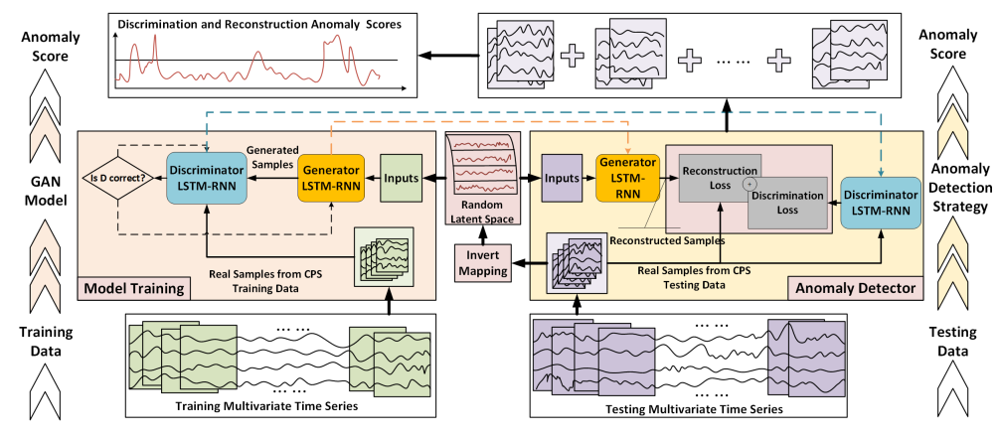

# MAD-GAN: Multivariate Anomaly Detection with GAN in PyTorch

This repository contains a modern PyTorch implementation of the Multivariate Anomaly Detection with Generative Adversarial Networks (MAD-GAN) model, as described in the [MAD-GAN paper](https://arxiv.org/pdf/1901.04997.pdf).



## Setting Up the Environment

This project uses conda for managing the virtual environment. We provide configuration files for both GPU and CPU versions of PyTorch. Please ensure that CUDA and cuDNN are properly installed if you plan to use the GPU environment.

To create the environment, use one of the following commands:

```bash
# For GPU environment
conda env create -f environment-gpu.yaml

# For CPU environment
conda env create -f environment-cpu.yaml
```

## Preparing the Data
First, download the SWaT dataset and extract it to the data directory. Then, run the following commands to generate the preprocessed data:

```bash
# For training data
python -m madgan convert 'data/SWaT_Dataset_Normal_v0.xlsx' 'data/swat_train.csv' --sheet-name Normal.cs 

# For testing data
python -m madgan convert 'data/SWaT_Dataset_Attack_v0.xlsx' 'data/swat_test.csv'  
```

## Training the Model
The configuration for the training process is located in `config/sweat-train-config.yaml`. You can duplicate or edit this file as needed. To start the training process, run the following command:


```bash
python -m madgan train config/swat-train-config.yaml 
```

## Detecting Anomalies

To detect anomalies, first edit the configuration file `config/swat-test-config.yaml` as needed. Then, run the following command:

```bash
python -m madgan detect config/swat-test-config.yaml
```


## References

[1] [MAD-GAN: Multivariate Anomaly Detection for Time Series Data with Generative Adversarial Networks](https://arxiv.org/pdf/1901.04997.pdf)
